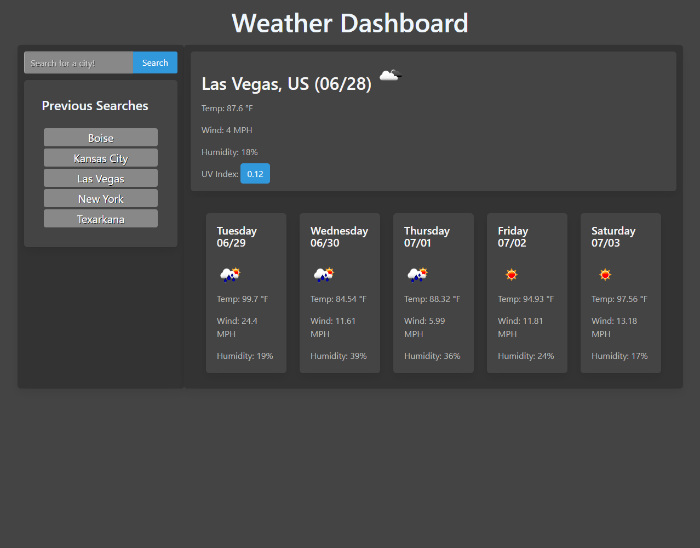

# Simple-Weather-App

## Background
After learning about server-side API's and how to use fetch, I had a bit of a shock. *Basically every site I visit makes heavy use of API calls.* I feel like I'm beginning to "peel back the layers" of the internet, and am now seeing how it truly works.
So naturally I wanted to test my newfound abilities, and why not start with a weather application? The data returned is easy to work with, and makes for good practice.

## Description
When you search for a city, an API call is made to OpenWeatherMap to get the city's latitude and longitude, then another call is made using OWM's onecall API, to get today's wether, and the next 5 days of weather. The city is then saved to local storage, and will appear under "Previous searches" when you either: reload the page, or search for a new city.

## Technologies Used
Bulma, jQuery, Moment.js, OpenWeatherMap APIs

## Link
[Click here to see the finished site.](https://jcpickens0215.github.io/Simple-Weather-App/)

## Screenshot

## License
The MIT License (MIT)
Copyright © 2021 Justin Pickens

Permission is hereby granted, free of charge, to any person obtaining a copy of this software and associated documentation files (the “Software”), to deal in the Software without restriction, including without limitation the rights to use, copy, modify, merge, publish, distribute, sublicense, and/or sell copies of the Software, and to permit persons to whom the Software is furnished to do so, subject to the following conditions:

The above copyright notice and this permission notice shall be included in all copies or substantial portions of the Software.

THE SOFTWARE IS PROVIDED “AS IS”, WITHOUT WARRANTY OF ANY KIND, EXPRESS OR IMPLIED, INCLUDING BUT NOT LIMITED TO THE WARRANTIES OF MERCHANTABILITY, FITNESS FOR A PARTICULAR PURPOSE AND NONINFRINGEMENT. IN NO EVENT SHALL THE AUTHORS OR COPYRIGHT HOLDERS BE LIABLE FOR ANY CLAIM, DAMAGES OR OTHER LIABILITY, WHETHER IN AN ACTION OF CONTRACT, TORT OR OTHERWISE, ARISING FROM, OUT OF OR IN CONNECTION WITH THE SOFTWARE OR THE USE OR OTHER DEALINGS IN THE SOFTWARE.

## Contact
You can e-mail me at: justin.pickens.1994@gmail.com
