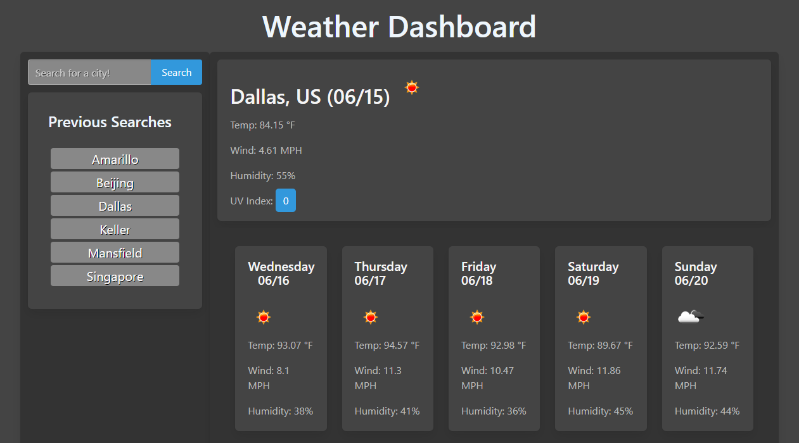

# Simple-Weather-App

## Background
After learning about server-side API's and how to use fetch, I had a bit of a shock. *Basically every site I visit makes heavy use of API calls.* I feel like I'm beginning to "peel back the layers" of the internet, and am now seeing how it truly works.
So naturally I wanted to test my newfound abilities, and why not start with a weather application? The data returned is easy to work with, and makes for good practice.

## Description
When you search for a city, an API call is made to OpenWeatherMap to get the city's latitude and longitude, then another call is made using OWM's onecall API, to get today's wether, and the next 5 days of weather. The city is then saved to local storage, and will appear under "Previous searches" when you either: reload the page, or search for a new city.

## Link
[Click here to see the finished site.](https://jcpickens0215.github.io/Simple-Weather-App/)

## Screenshot
